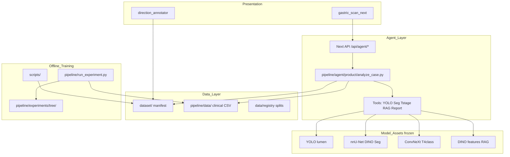
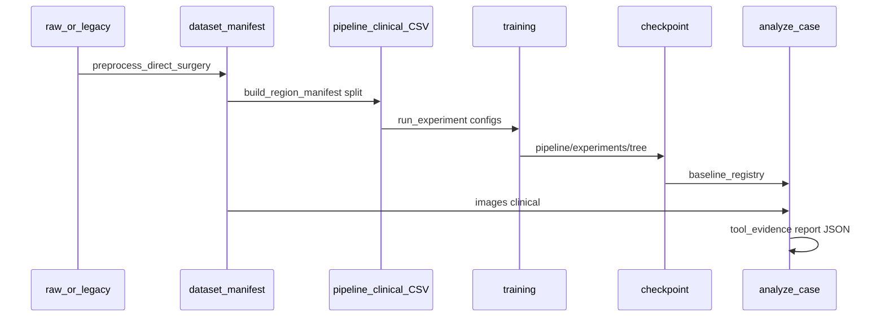

# GastricTstaging 系统架构总览

**本文档是「系统长什么样」的唯一架构入口。** 临床叙事与执行细节仍见 [mainline/gastric_tstaging_project_framework_zh.md](mainline/gastric_tstaging_project_framework_zh.md)。

**第一次打开仓库？** 读 **[START_HERE.md](../START_HERE.md)**。七类资产放哪？见 **[REPO_LAYOUT.md](../REPO_LAYOUT.md)**。

---

## 0. 七类资产（一览）

| 类 | 目录 | 入口 README |
|----|------|-------------|
| 原始数据 | `data/raw/`、`artifacts/raw_imports/`、`artifacts/video_frames/` | [data/raw/README.md](../data/raw/README.md) |
| 数据集 | `dataset/`、`pipeline/data/`、`data/registry/` | [dataset/DATASET_GUIDE.md](../dataset/DATASET_GUIDE.md) |
| 实验记录 | `experiments/`、`pipeline/experiments/`、`artifacts/results/` | [experiments/README.md](../experiments/README.md) |
| 文档 | `docs/`、`archive/docs_legacy/` | [docs/README.md](README.md) |
| 代码脚本 | `scripts/`、`pipeline/`、`configs/` | [scripts/README.md](../scripts/README.md) |
| 平台 | `apps/` | [apps/README.md](../apps/README.md) |
| 模型 | `models/`、`artifacts/model_weights/`、`pipeline/experiments/tree/` | [models/README.md](../models/README.md) |

---

## 1. 一句话

**胃充盈超声术前 T 分期（P0）+ 多工具证据融合的辅助诊断 Agent（P1）**；底层是已训练好的检测/分割/T 分期模型资产，上层是 Next.js 工作台与 Python Agent，数据以 `dataset/` + 注册表/split 为正式口径。

---

## 2. 系统分层（运行时）



| 层 | 职责 | 主要路径 |
|----|------|----------|
| **数据** | 正式影像、manifest、临床表、建模 CSV | [dataset/](../dataset/)、[data/registry/](../data/registry/)、[pipeline/data/](../pipeline/data/) |
| **模型资产** | 已冻结 checkpoint、scoreboard | [pipeline/experiments/mainlines/tstaging_4class/](../pipeline/experiments/mainlines/tstaging_4class/)、[experiments/baselines/](../experiments/baselines/) |
| **离线训练** | 新实验、特征缓存、报告 | [scripts/](../scripts/README.md)、[pipeline/](../pipeline/README.md)、[configs/](../configs/) |
| **Agent** | 病例级推理、证据 JSON、记忆 | [pipeline/agent/](../pipeline/agent/)、契约 [mainline/agent_api_contract.md](mainline/agent_api_contract.md) |
| **产品** | 医生浏览、Agent 工作台、方向标注 | [apps/gastric_scan_next/](../apps/gastric_scan_next/)、[apps/direction_annotator/](../apps/direction_annotator/) |

---

## 3. 仓库目录地图（代码与数据）

只列**会改、会跑**的路径；GB 级实验树见 [experiments/LARGE_ARTIFACTS.md](../experiments/LARGE_ARTIFACTS.md)。

```text
GastricTstaging/
├── REPO_LAYOUT.md     ← 七类资产地图（必读）
├── docs/              ← 文档
├── dataset/           ← 数据集（正式 manifest）
├── data/              ← 注册表 / raw / metadata
├── experiments/       ← 实验记录入口 + registry.csv
├── pipeline/          ← 代码 + Agent + 实验落盘
├── scripts/ + configs/
├── apps/              ← 平台
├── models/            ← 模型索引（实体在 artifacts / tree）
├── artifacts/         ← 大文件（zip、权重、results、抽帧）
└── archive/           ← 历史（含 docs_legacy）
```

旧路径兼容 symlink 集中在 **`_compat/`**（见 [_compat/README.md](../_compat/README.md)），根目录不再散落中文名与 zip。

**不要当作正式入口**：`_compat/`、`docs/references/*`；直接浏览 `pipeline/experiments/tree/`（用 registry 查）。

---

## 4. 核心数据流



| 步骤 | 说明 | 文档 |
|------|------|------|
| 预处理 | `original` / `crop_ui` / `crop_roi` | [dataset/DATASET_GUIDE.md](../dataset/DATASET_GUIDE.md) |
| 建模 CSV | `*_clinical.csv`，含 ROI、mask、clinical22 | DATASET_GUIDE §建模口径 |
| 训练 | `pipeline/run_experiment.py` + yaml | [pipeline/README.md](../pipeline/README.md) |
| 选型 | scoreboard + baseline_registry | [pipeline/experiments/reports/tstaging_4class_mainline_summary.md](../pipeline/experiments/reports/tstaging_4class_mainline_summary.md) |
| 推理 | `analyze_case.py` → Next API | [mainline/agent_api_contract.md](mainline/agent_api_contract.md) |

---

## 5. 文档分层（解决「文档太多」）

全库 `docs/` 约千余个文件，**默认只认下面三层**。

### Tier A — 必读（≤10 份，定义「现在是什么」）

| 文档 | 用途 |
|------|------|
| **本文** `docs/ARCHITECTURE.md` | 系统架构与导航 |
| [mainline/gastric_tstaging_project_framework_zh.md](mainline/gastric_tstaging_project_framework_zh.md) | 临床目标、优先级 P0–P4、资产表 |
| [mainline/tstaging_current_mainline.md](mainline/tstaging_current_mainline.md) | 当前三阶段执行（审计→整合→冻结验证） |
| [dataset/DATASET_GUIDE.md](../dataset/DATASET_GUIDE.md) | 数据口径、多中心、split |
| [mainline/agent_api_contract.md](mainline/agent_api_contract.md) | 前后端 Agent JSON 契约 |
| [MAINTENANCE.md](../MAINTENANCE.md) | 仓库整理与路径规则 |
| [scripts/README.md](../scripts/README.md) | 脚本主线顺序 |
| [data_governance/data_split_policy.md](data_governance/data_split_policy.md) | 患者级 split 纪律 |
| [experiment_governance/experiment_structure.md](experiment_governance/experiment_structure.md) | 实验证据包结构 |
| [evaluation/validation_protocol.md](evaluation/validation_protocol.md) | 内外部验证协议 |

可视化总览（浏览器）：[mainline/gastric_tstaging_project_logic.html](mainline/gastric_tstaging_project_logic.html)

### Tier B — 按角色深入（需要时再开）

| 角色 | 推荐阅读 |
|------|----------|
| **做 T 分期实验** | [mainline/model_asset_audit.md](mainline/model_asset_audit.md)、[mainline/tstaging_classifier_architecture_zh.md](mainline/tstaging_classifier_architecture_zh.md)、scoreboard CSV |
| **做 Agent / RAG** | [mainline/gastric_us_agent_clinical_workflow_model_inventory_dino_memory.md](mainline/gastric_us_agent_clinical_workflow_model_inventory_dino_memory.md)、[mainline/gastric_us_agent_scientific_validation_and_case_rag_plan_zh.md](mainline/gastric_us_agent_scientific_validation_and_case_rag_plan_zh.md) |
| **做大课题 / 自进化** | [mainline/multimodal_evidence_agent_self_evolution_mainline.md](mainline/multimodal_evidence_agent_self_evolution_mainline.md)、[mainline/self_evolving_multimodal_agent_platform_blueprint.md](mainline/self_evolving_multimodal_agent_platform_blueprint.md) |
| **做分割 / DINO** | [experiments/baselines/](../experiments/baselines/)、`docs/references/dinov3/`（参考，非 SSOT） |
| **写论文** | [gastric_paper/](gastric_paper/)、[visualization/visualization_standard.md](visualization/visualization_standard.md) |

### Tier C — 归档（默认不读）

| 位置 | 说明 |
|------|------|
| `docs copy/` | 历史汇报合并稿 → 将迁至 `archive/docs_legacy/` |
| `docs/archive_refs/` | 旧 Tstaging 迁移摘要 |
| `docs/references/segdino/`、`docs/references/dinov3/` | 阶段性实验记录（202605 前后） |
| `docs/agent_memory/` | Agent 记忆草案与候选 |
| `docs/github_agent_docs/` | OpenClaw/Hermes 对比笔记 |
| `docs/mainline/figures/results/` | 出图产物与 meta JSON |
| `pipeline/experiments/tree/` | 单次 run 目录（用 registry 索引） |

完整索引表：[DOCUMENT_MAP.md](DOCUMENT_MAP.md)

---

## 6. Agent 工具链（逻辑顺序）

与框架文档 §3.2 一致，便于和代码对照：

```text
LumenDetection(YOLO) → LesionSegmentation → WallBandBuilder
  → TStagingClassifier ★ → Clinical / Report
  → CaseRAG + RAGGate（仅边界） → EvidenceSynthesizer → JSON + 工作台
```

实现入口：`pipeline/agent/product/analyze_case.py`；后端注册计划：`pipeline/agent/configs/model_tool_backends.yaml`。

---

## 7. 当前工程阶段（对齐主线）

| 阶段 | 在做什么 | 少做什么 |
|------|----------|----------|
| **A 资产审计** | 读 scoreboard，定 Agent 默认 T checkpoint | 大规模新 backbone |
| **B Agent 整合** | 真实分类器接入、Workbench 对齐 JSON | 孤立 RAG demo |
| **C 冻结验证** | 内外部 + prospective，Agent vs T-only | 用外部调参后再报外部 |

详见 [mainline/tstaging_current_mainline.md](mainline/tstaging_current_mainline.md)。

---

## 8. 与其他入口的关系

```text
README.md（仓库门牌）
    → docs/ARCHITECTURE.md（本文：系统架构）
        → mainline/gastric_tstaging_project_framework_zh.md（临床与资产叙事）
        → dataset/DATASET_GUIDE.md（数据 SSOT）
        → DOCUMENT_MAP.md（全文档索引）
    → MAINTENANCE.md（路径迁移与 Git 纪律）
```

**新增文档规则**：先判断属于 Tier A/B/C；若只是单次实验记录，写在 `pipeline/experiments/reports/<name>/README.md`，不要堆进 `docs/mainline/`。
