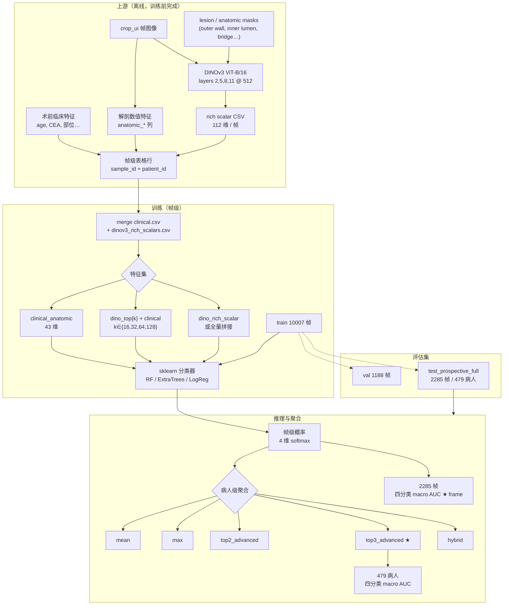

# Frame+agg · Prospective 架构说明

## 文档定位

本文档说明 **DINOv3 帧级标量 + 临床/解剖表格特征** 在 **协和前瞻全量测试集**（`test_prospective_full`）上的管线架构，并解释两条常被并列提及的结果：

| 层级 | 最佳配置 | 四分类 macro AUC | 含义 |
|------|----------|------------------:|------|
| **帧级（frame）** | `clinical_anatomic` + RandomForest，`aggregation=none` | **0.8084** | 每一帧独立预测，直接在 2285 帧上算 AUC |
| **病人级（patient）** | `clinical_anatomic` + RandomForest，`aggregation=top3_advanced` | **0.8034** | 先帧级预测，再按病人聚合 479 例后算 AUC |

报告目录中的命名：

- **`dinov3_framelevel_scalar_train_eval`** → 图中简称 **Frame+agg · Prospective**
- **`dinov3_framelevel_scalar_train_eval_rerun_20260516_check`** → **Frame · Prospective (rerun)**：2026-05-16 复跑校验，**数值与主报告完全一致**

对应脚本：`scripts/run_dinov3_framelevel_scalar_train_eval.py`  
结果 CSV：`pipeline/experiments/reports/dinov3_framelevel_scalar_train_eval/framelevel_dinov3_scalar_results.csv`  
**交互报告（统计图 + 架构 + DINO 病例）**：[`dinov3_framelevel_scalar_prospective_architecture.html`](dinov3_framelevel_scalar_prospective_architecture.html)（由 `scripts/generate_framelevel_prospective_stats_html.py` 生成；病例图由 `scripts/generate_framelevel_prospective_dino_case_panels.py` 生成）

---

## 1. 设计动机：为何是「帧级训练 + 晚期聚合」

### 1.1 旧方案的问题

早期部分实验在 **病人级** 先把多帧特征平均/拼接，再训练一个分类器。这样会 **抹平关键帧信号**：例如 T3/T4 突破征象可能只出现在 1～2 个切面，平均后变弱。

### 1.2 本方案原则

```text
帧级学习（保留每帧证据）
    → 帧级四分类概率 P(T|c, frame_i)
    → 病人级晚期聚合（top-k / hybrid）
    → 病人级四分类概率 P(T|c, patient)
```

DINOv3 在本管线中 **不端到端反传**，而是以 **预缓存的 region scalar** 形式进入表格模型；与 **E2E ConvNeXt ROI** 路线并行，职责不同。

---

## 2. 端到端架构图



---

## 3. 数据与划分

| Split | 临床 CSV | 帧数 | 说明 |
|-------|----------|-----:|------|
| **train** | `pipeline/data/tstaging_4class_anatomic_region_contrastive/regions/train_clinical.csv` | 10 007 | 含协和 + 多中心，`anatomic_status=ok` |
| **val** | `…/val_clinical.csv` | 1 188 | 调参/早停参考（本实验以固定 RF 为主） |
| **test_prospective_full** | `pipeline/data/tstaging_4class_prospective_full_anatomic/regions/test_prospective_full_clinical.csv` | 2 285 → **479 病人** | **主汇报集**（协和前瞻全量） |

帧与标量通过 `sample_id` / `patient_id` **inner join**；缺标量或 `anatomic_status≠ok` 的帧剔除。

DINO 标量目录：

```text
pipeline/data/dinov3_tstaging_region_scalars/multilayer_vitb16_512/
  train_dinov3_rich_scalars.csv
  val_dinov3_rich_scalars.csv
  test_prospective_full_dinov3_rich_scalars.csv
```

生成脚本：`scripts/cache_dinov3_tstaging_rich_scalars.py`（ViT-B/16，层 `[2,5,8,11]`，输入 512×512）。

---

## 4. 特征层

### 4.1 临床 + 解剖（`clinical_anatomic`，43 维）

**术前临床（22 维，含 missing 指示）**

- `age`, `sex`, `tumor_length_cm`, `tumor_thickness_cm`, `tumor_location`
- `cea_value` / `cea_binary`, `ca199_value` / `ca199_binary`
- `lauren_type`, `differentiation`
- 各字段配套 `*_missing` 二值列

**帧级解剖 / 壁层（21 维）**

- 区域面积：`anatomic_lesion_area_px`, `outer/inner/bridge` band
- 距离与角度：`anatomic_lesion_lumen_distance_*`, `anatomic_outward_angle_deg`
- 内外壁统计：`anatomic_outer/inner_mean|std|lap_var` 及 delta
- 控件与 crop：`box_guided_focus_area_px`, `control_wall_quality_score`, `crop_box_*` 等

来源：anatomic region contrastive 流水线产出的 **可部署 mask** 与数值特征，**不依赖 GT lesion crop 作为正式推理输入**。

### 4.2 DINO rich scalar（112 维 / 帧，可选）

对每个 transformer 层，在 token 网格上对以下区域做 pooling 并构造标量关系：

| 区域 | 含义 |
|------|------|
| `global` | 全图 token 均值 |
| `lesion` | 病灶预测 mask |
| `outer` / `inner` | 外壁 / 内腔 |
| `bridge` | 突破桥接带 |
| `wall` | 病灶-胃腔-壁复合带 |
| `boundary` | 病灶边界环 |

标量类型包括：区域间 **cosine / L2**、区域 **norm**、mask **面积占比**、**top-k token** 与 global/lesion 的 cos、patch 余弦统计、**CLS token** 关系等。

**Top-k 特征选择**：在 train 上对 112 维 DINO 标量做 `f_classif`，取 top 16/32/64/128，再与 43 维临床解剖拼接 → `dino_top{k}_plus_clinical_anatomic`。

---

## 5. 帧级分类器

| 模型 | 要点 |
|------|------|
| **random_forest**（最佳） | 900 棵树，`max_depth=9`，`class_weight=balanced_subsample` |
| extra_trees | 1200 棵树，作对照 |
| logreg | `C=0.5`，`StandardScaler`，作对照 |

流水线：`SimpleImputer(median)` → 分类器。  
标签：`class_label` ∈ {0,1,2,3} → **T1, T2, T3, T4+**。

训练仅在 **train 帧** 上 fit；val / test **不泄漏**。

---

## 6. 病人级聚合（Frame+agg 的 agg）

对同一 `patient_id` 的所有帧概率矩阵 `P ∈ R^{n_frames × 4}`：

| 模式 | 公式直觉 | 全前瞻 test 上 macro AUC |
|------|----------|-------------------------:|
| `mean` | 所有帧概率平均 | 0.8005 |
| `max` | 每类取 max 再归一化 | 略低于 top3 |
| `top2_advanced` | 按 `P(T3)+P(T4+)` 选最高 2 帧再平均 | 0.8028 |
| **`top3_advanced`** | 按晚期分数选最高 **3** 帧再平均 | **0.8034** |
| `hybrid` | `0.5 × top3_advanced + 0.5 × mean` | 0.8022 |

**`top3_advanced` 设计理由**：T 分期升高往往由少数「最重」切面驱动；用 T3+T4 得分选 top 帧，比全帧 mean 更对齐临床阅片习惯。

帧级 **不做聚合**（`aggregation=none`），直接在每帧上算 macro OvR AUC → **0.8084**。

> **注意**：帧级 AUC（0.808）高于病人级最佳（0.803）并不矛盾——评估单位不同（2285 帧 vs 479 病人），且帧间标签在同一病人内重复，帧级 AUC 不能等同于「最终部署病人级性能」。

---

## 7. 主结果明细（test_prospective_full，RandomForest + clinical_anatomic）

### 7.1 帧级最佳（macro AUC = 0.8084）

| 指标 | 值 |
|------|-----:|
| 四分类 macro OvR AUC | **0.8084** |
| Early vs Advanced (T1/T2 vs T3/T4+) | 0.8884 |
| T1 vs T2 | 0.7806 |
| T2 vs T3 | 0.8157 |
| T3 vs T4+ | 0.7945 |
| Accuracy / Balanced accuracy | 0.559 / 0.559 |
| n_eval | 2285 帧 |

### 7.2 病人级最佳（macro AUC = 0.8034，top3_advanced）

| 指标 | 值 |
|------|-----:|
| 四分类 macro OvR AUC | **0.8034** |
| Early vs Advanced | 0.8852 |
| T1 vs T2 | 0.7587 |
| T2 vs T3 | 0.7716 |
| T3 vs T4+ | **0.8241** |
| Accuracy / Balanced accuracy | 0.574 / 0.546 |
| n_eval | 479 病人 |

病人级在 **T3/T4+ 边界** 上更强（0.824），T2/T3 略弱于帧级；top3 聚合偏向保留「最重切面」的晚期信号。

### 7.3 DINO 标量在本设置下的表现

| 特征集 | 病人级最佳 macro AUC | 相对 clinical-only |
|--------|---------------------:|--------------------|
| `clinical_anatomic` | **0.8034** (top3_advanced) | 基准 |
| `dino_top16_plus_clinical_anatomic` | 0.7995 | 略降 |
| `dino_rich_scalar` 单独 | 明显更低 | 不足 |

结论：**静态 表格堆叠 DINO scalar 未超过纯临床+解剖**；DINO 信息需在 **帧级神经网络 / token 交互** 阶段注入（见项目下一步 ConvNeXt + DINO token 融合）。

---

## 8. 与 Frame+agg · External 的关系

| 项目 | Prospective（本文） | External |
|------|---------------------|----------|
| 报告目录 | `dinov3_framelevel_scalar_train_eval` | `dinov3_framelevel_scalar_external_eval` |
| 训练数据 | 同上 train/val | **同一 train/val** |
| 测试 CSV | `test_prospective_full_clinical.csv` | 外部队列 CSV（脚本 `run_dinov3_framelevel_scalar_external_eval.py`） |
| 病人级最佳 macro AUC | **0.8034** | **0.8139**（mean + clinical_anatomic） |

External 略高，可能与队列难度、帧数分布有关；**架构相同**，仅测试集不同。

---

## 9. 复现命令

```bash
# 1) 若尚无 DINO 标量缓存（需 GPU）
python scripts/cache_dinov3_tstaging_rich_scalars.py \
  --input-csv pipeline/data/tstaging_4class_anatomic_region_contrastive/regions/train_clinical.csv \
  --split-name train

# 2) 帧级训练 + 聚合评估
python scripts/run_dinov3_framelevel_scalar_train_eval.py

# 3) 出 AUC 对比图
python scripts/generate_dinov3_classification_auc_figure.py
```

复跑校验（可选）：

```bash
python scripts/run_dinov3_framelevel_scalar_train_eval.py \
  --output-dir pipeline/experiments/reports/dinov3_framelevel_scalar_train_eval_rerun_20260516_check
```

---

## 10. 相关文件索引

| 类型 | 路径 |
|------|------|
| 运行脚本 | `scripts/run_dinov3_framelevel_scalar_train_eval.py` |
| DINO 标量缓存 | `scripts/cache_dinov3_tstaging_rich_scalars.py` |
| 实验 README | `pipeline/experiments/reports/dinov3_framelevel_scalar_train_eval/README.md` |
| 结果表 | `…/framelevel_dinov3_scalar_results.csv` |
| 汇总 JSON | `…/summary.json` |
| AUC 汇总图 | `docs/mainline/figures/results/dinov3_classification_auc_*.png` |
| 多模态总览 | `docs/references/segdino/gastric_us_multimodal_agent_pipeline_summary_zh.md` §4.1 |

---

## 11. 临床部署解读（简）

**推荐汇报口径（病人级）**：

```text
帧级：临床 + 解剖表格特征 → RandomForest
聚合：病人级 top3_advanced（按 T3+T4 得分取 top 3 帧）
数据集：test_prospective_full（479 例）
四分类 macro AUC = 0.803
```

**帧级 0.808** 用于说明「单帧判别力上限」与特征工程有效性；**正式患者级 T 分期** 应以 **0.803 病人级 + top3_advanced** 为准。

---

## 12. DINO 病例效果可视化

HTML 报告 **「DINO 病例」** 一节展示 15 例前瞻测试面板（每类 3 例）：

| 分组 | 说明 |
|------|------|
| `correct_advanced` | 正确预测 T3/T4+，高置信 |
| `correct_early` | 正确预测 T1/T2，高置信 |
| `errors_high_conf` | 高置信误诊（供错误分析） |
| `t2_t3_boundary` | T2/T3 边界病例 |
| `t3_t4_understage` | T4+ 低估为 T3 |

每例展示 top-3 advanced 帧，8 列：**原图 · 解剖 overlay · Rainbow PCA（官方）· Cosine@病灶中心（官方）· token norm · Lesion affinity · Outer−inner · 帧概率**。

生成命令：

```bash
python scripts/generate_framelevel_prospective_dino_case_panels.py
python scripts/generate_framelevel_prospective_stats_html.py
```

产物：`docs/mainline/figures/results/case_framelevel_prosp_dino_*.png`

---

*最后更新：与 `dinov3_framelevel_scalar_train_eval` 报告及 2026-05-16 rerun 校验一致。*
