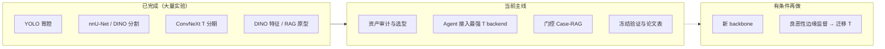
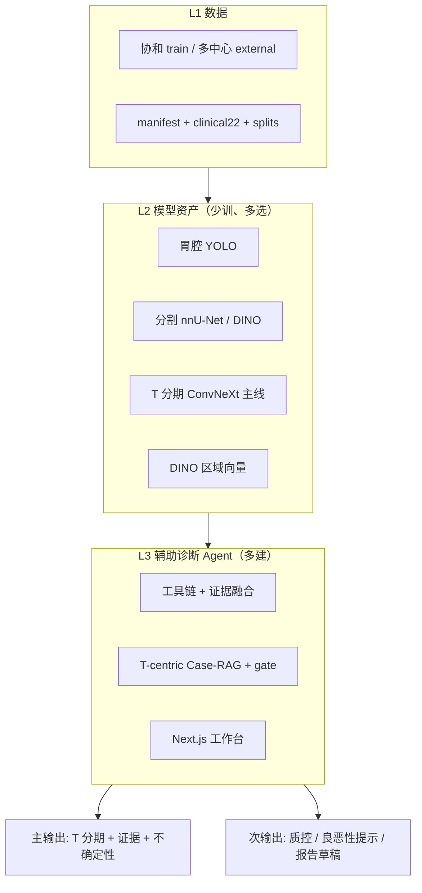
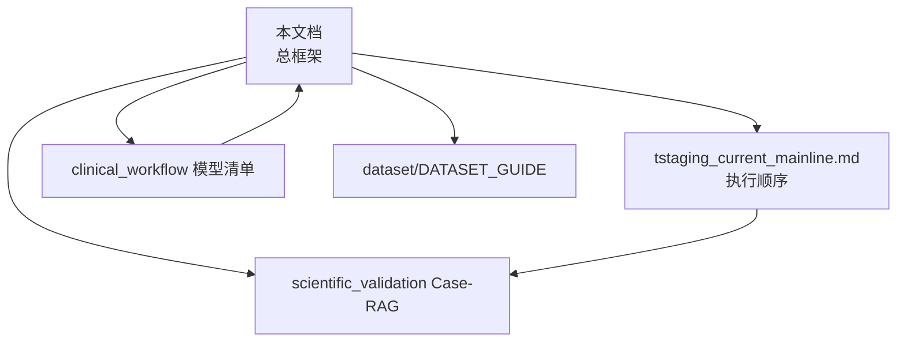

# 胃癌术前充盈超声辅助诊断 Agent — 项目总框架

## 文档定位

本文档是 **GastricTstaging** 的**唯一总框架入口**：说明项目终局、任务优先级、已有模型资产、Agent 如何整合这些资产，以及接下来应做什么。

**可视化总览（HTML）**：在浏览器中打开 [`gastric_tstaging_project_logic.html`](gastric_tstaging_project_logic.html) 可查看带流程图、**完整数据规模表**与导航的逻辑页（§9 含 manifest / split / 多中心 / T 分布）。

| 文档 | 关系 |
|------|------|
| [`tstaging_current_mainline.md`](tstaging_current_mainline.md) | **当前执行主线**（与本文 §6 对齐） |
| [`gastric_us_agent_scientific_validation_and_case_rag_plan_zh.md`](gastric_us_agent_scientific_validation_and_case_rag_plan_zh.md) | T 分期 Agent 的科研验证与 Case-RAG 细则 |
| [`gastric_us_agent_clinical_workflow_model_inventory_dino_memory.md`](gastric_us_agent_clinical_workflow_model_inventory_dino_memory.md) | Agent 工具链与模型清单 |
| [`../../dataset/DATASET_GUIDE.md`](../../dataset/DATASET_GUIDE.md) | 数据口径与统计 |

---

## 0. 逻辑主线（先读这一段）

项目已经历多轮 **单点模型训练**（YOLO 胃腔、nnU-Net/DINO 分割、ConvNeXt T 分期、DINO 特征、良恶性对照等），积累了大量可复用结果。**当前阶段最重要的工作，不是再开一条新 backbone 训练线，而是：深入理解这些结果 → 选出可信能力 → 组装成可追溯的术前充盈超声辅助诊断 Agent 系统，并以 T 分期为核心终点做冻结验证。**

```text
临床终局（术前辅助诊断 Agent，T 分期为主）
        ↑
证据整合层（固定工具链 + 门控融合 + Case-RAG + 医生复核）
        ↑
已有模型资产层（YOLO / 分割 / ConvNeXt T / DINO 表征 — 已训练，待选型接入）
        ↑
数据与 split 纪律（协和单中心训练 + 多中心外部冻结验证）
```

**任务优先级（严格排序）**

| 优先级 | 任务 | 角色 |
|--------|------|------|
| **P0** | **胃癌 T 分期（T1/T2/T3/T4+）** | 临床主问题、论文主终点、Agent 主输出 |
| **P1** | **辅助诊断 Agent 系统** | 整合分割/分类/临床/报告/相似病例/指南，结构化输出 |
| **P2** | **Case-RAG 与证据门控** | 在 T 边界（T2/T3、T3/T4+）提供可量化增益与可解释性 |
| **P3** | **良恶性二分类** | 曾用于验证 shortcut/域泛化；**先做、但不是最重要** |
| **P4** | 新 backbone / 大规模扩实验 | 仅当资产审计证明现有能力不够时才启动 |

**良恶性的正确定位**：它是 **方法试金石**（局部监督、域偏移、信号是否真实），不是项目的临床终局。T 分期难得多，Agent 的价值也主要体现在 **侵犯深度与边界判断**，而不是替代筛查级的良恶性模型。

---

## 1. 临床终局：术前充盈超声辅助诊断 Agent

### 1.1 场景与模态

| 项目 | 说明 |
|------|------|
| **模态** | **经腹胃充盈超声**（水充盈），不是 EUS |
| **主任务** | 术前 **T 分期** 辅助（四分类：T1 / T2 / T3 / T4+） |
| **系统形态** | **Agent**：多工具证据 → 结构化 JSON → 医生工作台复核 |
| **定位** | 分流与辅助决策（早期 vs 进展期、是否需 EUS/新辅助等）；不替代 EUS 的 N/M 评估 |

### 1.2 Agent 输出是一包综合 JSON，不是单句结论

一次运行会调用分割、T 分期、形态、临床、报告文本、相似病例、知识库等工具，并生成 mask/ROI 叠加图、T 概率图、胃壁与 DINO 可视化；返回体由 `analyze_case.py` 组装，顶层至少包含：

| 块 | 作用 |
|----|------|
| `report` | 融合后的推荐 T、置信度、`supporting_evidence` / `uncertainty_flags`、中文 `dynamic_report_draft` |
| `tool_evidence` | 五类工具原始输出（segmentation / classification / morphology / clinical / report） |
| `agent_steps` | 逐步审计链（约 14 步：分割 → 分类 → DINO → 相似病例 → 综合 …） |
| `prediction_artifacts` | 各模型推理产物的 URL（mask、概率条、wall、DINO、相似病例拼图） |
| `similar_cases` / `knowledge_context` | 病例检索与指南片段 |
| `runtime_verification` / `trajectory_ref` | 是否真实调用模型、完整结果落盘路径 |

医生可读的核心仍在 `report.recommended_t_stage`；科研审计需看 `tool_evidence` + `agent_steps`。展开示例见 [`gastric_tstaging_project_logic.html`](gastric_tstaging_project_logic.html) §2。

**目标态字段**（计划补齐）：`conflicting_evidence`、`rag_weight`、患者级多帧 `T_probabilities`、Case-RAG 区域相似度分解。

### 1.3 为什么 T 分期必须是「最重要」

T 分期在超声上本质是 **患者级、多帧、胃壁层次** 问题：

- 病理 pT 是患者级标签，帧级噪声大；
- 关键切面未必在每一帧出现；
- **T2/T3、T3/T4+** 是已知瓶颈（不是再多训几个 epoch 就能消失）；
- 分割 Dice 高 ≠ 分期正确（项目已反复验证）。

因此 Agent 的设计中心是：**在已有 T 分期模型与 wall/ROI 证据之上，做患者级聚合、边界辅助、冲突与不确定性显式化**——而不是先做一个良恶性 Agent 再「顺便」做 T。

---

## 2. 项目阶段判断：从「模型竞赛」到「系统整合」

### 2.1 我们已经有什么（资产层）

下面不是待办清单，而是 **已经存在、需要被读懂和接入 Agent 的训练结果**。

#### A. 感知与定位（Stage 1）

| 能力 | 代表资产 | 成熟度 | Agent 用途 |
|------|----------|--------|------------|
| 胃腔检测 | YOLO11 baseline、`tstagenet_s1_lumen_detector` | 有 holdout 报告 | 缩小胃壁搜索、wall-band 坐标 |
| 病灶分割 | nnU-Net holdout、UNet/UNet++ | Dice ~0.82+ 量级（见分割 summary） | lesion mask、ROI、crop_roi |
| DINO/SegDINO 分割 | `experiments/segmentation/dinov3_*`、`segdino_vitb16_last2blocks_*` | 持续评估；部分优于或互补 nnU-Net | 候选 mask、区域 token、Case-RAG |
| Wall-band / breakthrough | region contrastive manifest、box-guided wall 实验 | pilot ~ production 之间 | T2/T3 边界证据、M2 分层分类 |

#### B. T 分期分类（Stage 2 — **核心资产**）

主结果登记在：

- `pipeline/experiments/tables/tstaging_4class_mainline_scoreboard.csv`
- `pipeline/experiments/reports/tstaging_4class_mainline_summary.md`
- `pipeline/experiments/mainlines/tstaging_4class/baseline_registry.yaml`

**已跑通的主线对照（节选，external / prospective AUC）**

| 路线 | external AUC | prospective AUC | 说明 |
|------|-------------|-------------------|------|
| Full Image + ROI + Clinical(22D) | **0.7276** | 0.6968 | 长期 primary baseline |
| Predicted Mask(4ch) + Clinical | **0.7326** | **0.7455** | structure 线 promoted |
| Predicted ROI + Mask + Clinical | 0.7438 | 0.6683 | 部署 realism 参考 |
| Breakthrough / region-aware + Clinical | **0.7480** | 0.6857 | 边界先验最强 external |
| box-guided wall contrastive 等 | 见各 report | 见各 report | 待统一接入 Agent |

**结论（资产层）**：T 分期上 **ConvNeXt 双分支 + ROI/mask + clinical22 + wall/region 特征** 已有明确优胜路线；继续无差别换 backbone **不是当前主线**。

#### C. DINO 表征与检索

| 资产 | 路径线索 | 用途 |
|------|----------|------|
| DINO rich scalar / frame-level | `pipeline/experiments/reports/dinov3_*` | 特征、校准、T2/T3 expert |
| Frozen-DINO Case-RAG | `scripts/train_learned_dino_case_rag.py` | R2/R5 分支；与 base 小权重融合有增益 |
| Agent 科学基准 | `pipeline/experiments/reports/gastric_us_agent_scientific_benchmark/` | M0–M5、R0–R5 对照表 |

#### D. Agent 产品与工具链（已可运行）

| 组件 | 路径 |
|------|------|
| 前端工作站 | `apps/gastric_scan_next/` |
| Agent 入口 | `pipeline/agent/product/analyze_case.py` |
| 工具 | segmentation / morphology / classification / clinical / report / similarity |
| 记忆 | FAISS case index、KnowledgeMemory、session trajectory |

**缺口**：ClassificationTool 已指向冻结 **mask4ch dual_branch**，但该路线 **推理不含** direction/arcband patch；**region-aware** 的 patch 主要在训练对比损失里，默认 eval 也不进 logits（见 [`tstaging_classifier_architecture_zh.md`](tstaging_classifier_architecture_zh.md)）。**相似病例**在 `SimilarityTool` + 融合层，**不在分类器 forward**。待接：`ContrastiveTStagingTool` / `GastricWallEvidenceNet` 推理，以及 DINO 区域 Case-RAG。

### 2.2 我们现在最缺什么（整合层）

> 展开版见 [`gastric_tstaging_project_logic.html`](gastric_tstaging_project_logic.html) **§5**（含代码路径与阶段依赖图）。

| # | 缺口 | 仓库现状（摘要） | 目标态 | 阶段 |
|---|------|------------------|--------|------|
| ① | **资产审计** | ✅ [`model_asset_audit.md`](model_asset_audit.md) + [`agent_backend_registry.yaml`](../pipeline/agent/config/agent_backend_registry.yaml) | 锁定 Agent 用哪条 T / seg / YOLO | A（文档完成） |
| ② | **T backend** | `ClassificationTool` 默认 → **冻结 mask4ch 20260423**（prospective **0.7455**）；region-aware（ext **0.748**）登记为辅助，待 contrastive 适配器 | 主表同源 + 外部证据 secondary | B |
| ③ | **Case 检索** | FAISS **17 维**（概率+形态+临床）；DINO 仅可视化 | 区域 DINO + T-aware RAG + `rag_weight` | B–C |
| ④ | **Split** | ✅ manifest：`pipeline/data/tstaging_4class/splits/xiehe_single_center_v1/`（`build_xiehe_only_agent_splits.py`） | 训练脚本默认读 internal-only CSV | B（manifest 完成，训练切换待做） |
| ⑤ | **患者级 MIL** | ✅ `analyze_case` 支持 `frames[]`（≤3 帧概率平均） | 全队列 MIL + 关键帧策略 | B（基础版已接） |
| ⑥ | **证据融合** | ✅ `conflicting_evidence` + `rag_gate`（schema 0.3.0） | Contrastive 次级证据进融合 | B（规则门控已接） |
| ⑦ | **工具链** | ✅ `LumenDetectionTool` + `WallEvidenceTool`（live SDF） | region-aware / wall-net 推理适配 | B+（主路径已接） |
| ⑧ | **前端** | ✅ Workbench 展示 lumen/wall/RAG/冲突；列表 `classification: pending` | 与 analyze 同一 backend 回写列表 | B（Workbench 已对齐 JSON） |

**选型已定（见 `model_asset_audit.md`）**：Agent **最终 T** = 冻结 **mask4ch 20260423**；**region-aware 20260426** 仅作 external 辅助证据（权重 0 直至 `ContrastiveTStagingTool`）；无医生 ROI 时 fallback **predroi+mask4ch 20260424**。

### 2.3 阶段转移示意图



---

## 3. 系统架构：以 T 分期为中心的 Agent

### 3.1 三层架构



### 3.2 Agent 工具链（目标顺序）

与 [`gastric_us_agent_current_flow_and_poe_architecture.md`](gastric_us_agent_current_flow_and_poe_architecture.md) 一致，但强调 **T 分期工具权重最高**：

```text
1. LumenDetectionTool（YOLO）          → 胃腔/质控
2. LesionSegmentationTool            → mask/ROI 可信度
3. WallBandBuilder                   → 侵犯深度证据（T 核心）
4. AdapterDINOEncoder（可选）        → 区域向量 / RAG
5. FrameEvidenceMIL                  → 多帧 → 患者级
6. TStagingClassifierTool ★          → dual_branch 主 checkpoint（global+ROI+mask+clinical）
6b. TStagingContrastiveTool（计划）  → contrastive_dual / wall-evidence；推理可选启用本例 patch
7. ClinicalTool / ReportTool         → 辅助证据
8. CaseRAGRetriever + RAGGate ★      → 仅边界/冲突时加权
9. EvidenceSynthesizer               → 推荐 T + 冲突 + 不确定性
10. 报告草稿 / Memory / Trajectory
```

**融合原则（T 为中心）**：

```text
final_T_probs = base_T_probs * (1 - rag_weight) + case_vote_T_probs * rag_weight
```

- `base_T_probs` 来自 **选定的 ConvNeXt T 主线**（不是良恶性头）；
- `rag_weight` 由 mask 质量、top-k entropy、T2/T3 边界不确定性、base-RAG 冲突决定；
- 良恶性信号仅作 **筛查提示或质控**，不覆盖 T 主结论。

### 3.3 数据策略（验证纪律）

见 [`gastric_us_agent_scientific_validation_and_case_rag_plan_zh.md`](gastric_us_agent_scientific_validation_and_case_rag_plan_zh.md) §1.1。要点：

- **仅协和 train** 训练 T 模型、建 RAG memory、做 SSL；
- **Tier-1 外部**（莆田系）报主外部 T 分期与 AUC；
- **时间切分**：2018–2022 train → 2023 val → 2023H2–2024 internal test → 2025 prospective；
- **M14**：首次外部评估后权重冻结。

**评估终点修正（相对旧版框架）**

| 层级 | 指标 |
|------|------|
| **主要** | **T 分期** accuracy / macro-F1 / balanced acc；T2 recall；T2/T3、T3/T4+ AUC（内部 + Tier-1 外部） |
| **次要** | 良恶性 AUC（泛化与质控）；校准、DCA |
| **Agent** | full agent vs base T-only；RAG 子组；检索 same-stage / same-boundary |

---

## 4. Case-RAG：服从 T 分期，不喧宾夺主

Case-RAG 是 Agent 的 **增强模块**，不是第二套主诊断器。

| 原则 | 说明 |
|------|------|
| 检索对象 | 侵犯模式相似的 **T 分期病例** + 指南条文 |
| 向量 | adapter-DINO 多区域（lesion / wall-band / breakthrough / control） |
| 训练 | 同 T、同边界为正；T2↔T3、T3↔T4+ 为 hard negative |
| 门控 | 边界模糊时加权；冲突时只展示；mask 差时不改 T |

实施阶段见科研计划 §8（Phase 0–6）；**Phase 0–1 优先于继续训新 RAG**。

---

## 5. 与「良恶性」「边缘监督」的关系

```text
                    ┌─────────────────────────────┐
                    │  术前辅助诊断 Agent（终局）   │
                    │  主输出：T 分期 + 证据链      │
                    └──────────────┬──────────────┘
                                   │
              ┌────────────────────┼────────────────────┐
              ▼                    ▼                    ▼
      T 分期模型主线          Case-RAG 门控          质控/良恶性提示
   (ConvNeXt+ROI+wall)      (边界/相似病例)         (可选、次要)
              │
              │ 方法论上可借鉴
              ▼
      边缘 patch 对比学习 ──→ 先在良恶性验证 shortcut
                              （不是最重要，但是有用）
```

- **继续做、但不主导资源**：良恶性边缘对比实验，用于验证「是否在看对地方」，有效再迁移到 T2/T3 patch；
- **不再作为论文主叙事**：主叙事是 **T 分期 Agent + 多中心冻结验证**。

---

## 6. 当前执行主线（2026 Q2 起）

[`tstaging_current_mainline.md`](tstaging_current_mainline.md) 与本节同步；默认按下列顺序执行。

### 6.1 第一阶段：读懂现有结果（2–3 周）

| 步骤 | 动作 | 交付物 |
|------|------|--------|
| 1 | 读 scoreboard + `baseline_registry.yaml` + 关键 report | `docs/mainline/model_asset_audit.md`（待建） |
| 2 | 定 Agent 默认 T backend（如 region-aware 或 mask4ch promoted） | `agent_backend_registry.yaml`（待建） |
| 3 | 梳理分割/YOLO 默认 checkpoint 与失败模式 | 接入 SegmentationTool 的 fallback 表 |
| 4 | 读 `gastric_us_agent_scientific_benchmark/scientific_summary.md` | RAG 是否保留进 Agent v1 |

### 6.2 第二阶段：Agent 整合（4–6 周）

| 步骤 | 动作 |
|------|------|
| 5 | Phase 0：协和-only split，移出 train 中 192 例外部 |
| 6 | ClassificationTool 接入选定 T checkpoint；输出完整 T 概率与边界头 |
| 7 | WallBand +（可选）DINO 区域特征进 SimilarityTool |
| 8 | EvidenceSynthesizer：支持/冲突/不确定性规则与 RAGGate |
| 9 | 前端 Workbench 与真实 backend 对齐，去掉 placeholder |

### 6.3 第三阶段：冻结验证与论文（6–8 周）

| 步骤 | 动作 |
|------|------|
| 10 | `evaluate_agent_scientific_benchmark.py` 全矩阵 M×R |
| 11 | 内部 test + prospective + Tier-1/2/3 外部冻结 |
| 12 | 论文表：T 主表 + Agent 消融 + 森林图 + 病例解释 |

### 6.4 明确暂缓

- 大规模新 backbone 四分类竞赛；
- 无 T 目标的 VLM 主线；
- 未接入 Agent 的孤立 RAG 演示；
- 在外部数据上继续训练后声称「外部验证」。

---

## 7. 目录与关键索引

| 用途 | 路径 |
|------|------|
| 数据 | `dataset/`、`dataset/DATASET_GUIDE.md` |
| T 分期建模 CSV | `pipeline/data/tstaging_4class_region_contrastive_full/regions/` |
| 实验 scoreboard | `pipeline/experiments/tables/tstaging_4class_mainline_scoreboard.csv` |
| 实验报告 | `pipeline/experiments/reports/` |
| 分类实验树 | `pipeline/experiments/tree/gastric_tstage_4class/` |
| 分割实验 | `experiments/segmentation/` |
| Agent | `pipeline/agent/`、`apps/gastric_scan_next/` |
| 科学基准 | `pipeline/experiments/reports/gastric_us_agent_scientific_benchmark/` |

---

## 8. 文档地图



**推荐阅读**

1. 本文档 §0–§3（逻辑与架构）
2. `tstaging_4class_mainline_summary.md` + scoreboard（**已有 T 结果**）
3. `gastric_us_agent_clinical_workflow_model_inventory_dino_memory.md`（Agent 现状）
4. `gastric_us_agent_scientific_validation_and_case_rag_plan_zh.md`（验证与 RAG）

---

## 9. 修订记录

| 日期 | 说明 |
|------|------|
| 2026-05-19 | 初版 |
| 2026-05-19 | **重构**：T 分期升为 P0；明确「模型资产整合 → Agent」阶段；良恶性降为方法验证；补充 scoreboard 与执行三阶段 |
