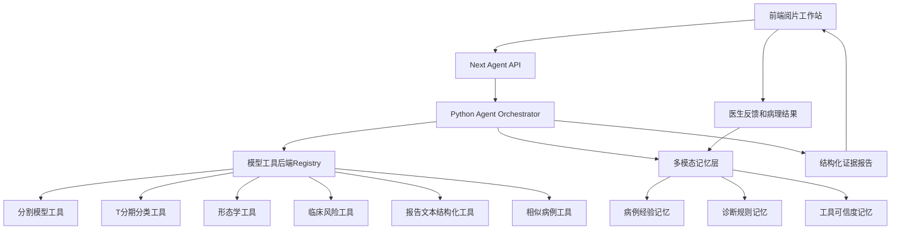

# 自演化多模态记忆 Agent 平台蓝图

## 文档定位

这份文档把当前前端系统平台、Python Agent、网络模型后端和多模态记忆层放到同一条实现主线里。

目标不是新开一个泛化聊天机器人，而是围绕胃癌 T 分期和后续良恶性、视频、报告融合任务，构建一个能长期积累病例经验、诊断规则和工具可信度的医学 Agent。

## 目标形态



## 当前已有链路

前端已经有一条可用链路：

1. `apps/gastric_scan_next/app/api/agent/analyze/route.ts`
2. `apps/gastric_scan_next/lib/agent-server.ts`
3. `pipeline/agent/product/analyze_case.py`
4. `pipeline/agent/tools/`
5. `pipeline/agent/memory/`

现在的请求流程是：

- 前端选择病例。
- Next API 解析图像、ROI、annotation、overlay、临床字段和可选报告文本。
- Python Agent 调用分割、分类、形态、临床、报告结构化、相似病例和知识检索工具。
- Agent 返回 `tool_evidence`、`similar_cases`、`knowledge_context`、`report` 和 `traces`。

这条链路已经足够作为自演化 Agent 的骨架。

## 需要补上的核心能力

### 1. 多模态记忆 schema

新增 schema：

- `pipeline/agent/memory/schemas/self_evolving_multimodal_memory.schema.json`

它定义五类记忆记录：

- `case_episode`：病例经验。
- `procedural_rule`：诊断规则。
- `tool_governance`：工具可信度。
- `session_trace`：会话轨迹。
- `model_backend_evidence`：模型后端证据。

这个 schema 是后续写入数据库、JSONL 或检索索引的共同契约。

### 2. 模型工具后端 registry

新增配置：

- `pipeline/agent/configs/model_tool_backends.yaml`

它把网络模型视为 Agent 工具后端，而不是散落在脚本里的 checkpoint。

每个后端需要声明：

- `backend_id`
- `tool_name`
- `model_task`
- `adapter_target`
- `checkpoint_path`
- `trust_label`
- `validation_summary`
- `known_limits`

这样 Agent 在报告里可以明确说：“本次使用了哪个模型后端，它在外部/前瞻数据上表现如何，当前应 trusted、caution 还是 avoid。”

### 3. 临床 Agent 技能

新增技能：

- `pipeline/agent/skills/t_staging_evidence_review/SKILL.md`
- `pipeline/agent/skills/t2_t3_error_analysis/SKILL.md`

技能不是模型代码，而是可版本化的诊断流程。它对应 Hermes/OpenClaw 的 skills 思想，也对应本项目自演化机制中的“诊断规则记忆”。

### 4. 病例级 trajectory

下一步应让 `analyze_case.py` 除了返回 `traces`，还落盘一个病例级 trajectory。

建议路径：

```text
tmp/agent_trajectories/<session_id>/<patient_id>_<timestamp>.json
```

每条 trajectory 应包含：

- 前端请求摘要。
- 输入模态引用。
- 每个工具调用。
- 模型后端 ID。
- 输出证据。
- 最终报告。
- 需要写入记忆的候选项。

### 5. 医生反馈写入

当前 `GET /api/agent/session/[sessionId]` 只读 session。后续应新增一个反馈入口：

```text
POST /api/agent/feedback
```

建议输入：

- `sessionId`
- `patientId`
- `doctorCorrection`
- `finalPathologyTStage`
- `qualityFlags`
- `acceptedEvidence`
- `rejectedEvidence`

反馈不应直接改 stable memory，而是写入 candidate memory 或病例经验记忆，等待复核。

## 网络模型作为工具后端

网络模型不应直接成为 Agent 的“脑子”，而应成为可审计工具。

### 工具后端分层

| 层次 | 示例 | Agent 看到什么 |
| --- | --- | --- |
| 感知模型 | lesion segmentation | mask、ROI、质量指标 |
| 诊断模型 | T staging classifier | 概率、top-1、uncertainty |
| 表征模型 | contrastive embedding | 相似病例、局部 patch 证据 |
| 文本模型 | report extractor | 超声所见、超声提示、内镜/病理文本、侵犯深度线索、冲突提示 |
| 视频模型 | video frame selector/classifier | 关键帧、良恶性概率、质量标记 |

Agent 不直接相信模型，而是读取：

- 后端 ID。
- 输入是否完整。
- 输出是否稳定。
- 该后端在类似场景下的历史可信度。
- 是否需要人工复核。

### 当前候选 T 分期后端

当前训练出的强候选后端是：

```text
tstage_4class_boxguided_contrastive_external_prospective_candidate_20260506
```

对应 run：

```text
pipeline/experiments/tree/gastric_tstage_4class/contrastive/contrastive_dual_convnext/tstaging_4class_boxguided_wall_region_contrastive_clinical22_prospective_auc_retention_external_recovery_from_refinement_best_20260506_222312
```

当前指标：

- `test_external AUC=0.7067`
- `test_external_newzip AUC=0.5682`
- `test_prospective AUC=0.7908`

解释：

- 前瞻集表现显著增强。
- 外部主测试保持可用。
- 新增外部 zip 仍弱，因此该后端应先标记为 `caution`，不能直接晋升 `trusted`。

## 前端平台如何呈现

前端不需要一次性变复杂。建议分三步：

### Step 1：证据面板

在现有 Agent 面板中增加：

- 模型后端 ID。
- 工具可信度标签。
- 当前病例可用模态，包括图像、ROI、mask、临床表和报告文本。
- 支持证据与冲突证据。
- 手动复核建议。

现已在前端病人类型和病例 API 中增加 `patient.report`。如果临床表中存在 `ultrasound_report`、`ultrasound_findings`、`ultrasound_impression`、`endoscopy_report` 或 `pathology_report` 等字段，病例详情页会展示“报告文本证据”，并通过 `POST /api/agent/analyze` 传入 Python Agent 的 `report_text`。

Python Agent 新增 `structure_report` 工具，先用确定性规则抽取报告线索，而不是让 LLM 直接从报告文本给 T 分期。这样报告成为证据链的一部分，仍需与图像、形态、分类模型和医生反馈交叉校验。

报告稿生成也应遵循同一原则：`analyze_case.py` 返回 `dynamic_report_draft`，草稿由结构化证据拼装成“病例与输入资料、多模态证据摘要、Agent 综合判断、不确定性与人工复核建议”四段。前端只把它作为可复制、可导出的医生复核草稿展示，不把它当作已签发诊断报告。

### Step 2：记忆候选面板

展示 Agent 建议写入的候选记忆：

- 新病例经验。
- 新诊断规则。
- 工具可信度更新。
- 需要医生确认的反馈项。

医生只需要选择接受、拒绝、稍后复核。

### Step 3：自演化审计面板

展示长期趋势：

- 哪些工具在外部中心变差。
- 哪些 T2/T3 错误重复出现。
- 哪些诊断规则被反复触发。
- 哪些模型后端应从 caution 晋升 trusted，或从 trusted 降级 caution。

## 最小实现顺序

近期建议按下面顺序推进：

1. 保持现有 `POST /api/agent/analyze` 不破坏。
2. 让 Python Agent 读取 `model_tool_backends.yaml`，在 `tool_evidence` 中加 `backend_id` 和 `trust_label`。
3. 把报告文本抽取结果写入 `tool_evidence.report`，并在前端 Agent 面板展示报告证据和冲突提示。
4. 生成 `dynamic_report_draft`，并在前端提供复制/后续导出入口。
5. 让 `analyze_case.py` 生成 trajectory JSON。
6. 新增 `memory_update_candidates` 到 report。
7. 新增 `POST /api/agent/feedback`，只写 candidate，不改 stable。
8. 再做 contrastive T-staging 新模型的 inference adapter。
9. 最后把前端面板从“报告展示”升级成“证据 + 记忆候选 + 反馈闭环”。

## 护栏

- 不把良性/溃疡/视频数据直接混进 T 分期 split。
- 不让 LLM 直接判断 T stage，必须经过工具证据。
- 不让报告文本直接覆盖图像模型或医生判断；报告只作为可追溯证据模态。
- 不让单一模型后端决定最终结论。
- 不让 cron 自动改 stable memory 或训练超参。
- 不让 caution 后端在报告中伪装成 trusted 后端。
- 不把 OpenClaw/Hermes runtime 当成临床主进程。

## 一句话总结

本项目的目标是：以前端阅片工作站为入口，以 Python Agent 为编排层，以网络模型为可审计工具后端，以多模态病例记忆和医生反馈为自演化来源，形成一个能长期学习但始终可追溯、可复核、可治理的医学辅助诊断系统。
